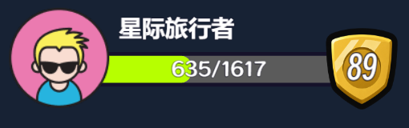

# Cue examples

This workspace contains real Vortex projects used to exercise Cue through its public packages.

Both projects use `cue compile` as a temporary bridge. Generated JavaScript is
written below each project's `src/generated/` and is intentionally ignored. OMS only consumes the generated
JavaScript; Cue does not modify or bypass the OMS module graph.

## Showcase

[Game UI Showcase](game-ui-showcase/README.md) presents complete game UI components built with Cue.
Case tabs select the examples; Cocos UI provides their state controls. The image below is captured from the running project.

| Preview | Description |
| --- | --- |
|  | **[Player profile](game-ui-showcase/src/cases/player-profile/player-profile.cue)** — A reactive lobby HUD with an avatar, nickname, level badge, and live experience bar. Change the nickname, font size, or width to see Flex reflow and text wrapping; level and experience update in place. |

## Local setup

1. Keep this repository next to `cc-extension-cue`.
2. Build the Cue repository with `node --run build`.
3. Run `pnpm install` in this repository.
4. Run `node --run build` to regenerate the ignored Cue modules.
5. Choose `basic` or `game-ui-showcase`, install its extensions with exm as documented in the project's README, then open that project in Vortex.
6. Open `assets/main.scene` and start Preview.

The projects serve different purposes:

- [basic](basic/README.md) has isolated Flex, Text, Image, Decoration, Position, Style API, Input,
  Button, Toggle, Slider, Select, TextInput, and NumberInput galleries.
- [game-ui-showcase](game-ui-showcase/README.md) has complete game UI components selected through a tab registry.

The controls use Cocos UI. The content of every gallery and showcase case is rendered by Cue.
The six built-in control galleries each compare default and custom Cue controls, with independent
values and event logs. Navigation, external presets, disabled/mode switches, remount actions, and
the native EditBox used for focus/IME comparison remain Cocos UI.
Input Gallery demonstrates Cue clicks, hover, propagation, pointer capture, clipping, transformed hits,
and `pointer-events` pass-through. The player HUD's avatar toggles profile details, and its draggable
experience meter shares state with the native controls.

Saved browser regressions exercise the running projects through actual mouse/touch input:
[`scripts/verify-input-preview.ts`](scripts/verify-input-preview.ts) checks the basic gallery, and
[`scripts/verify-hud-input-preview.ts`](scripts/verify-hud-input-preview.ts) checks the HUD.
Each requires a Preview URL and an explicit existing Playwright installation path. Commands and
screenshot output are documented in the respective project READMEs; no browser dependency is added here.
