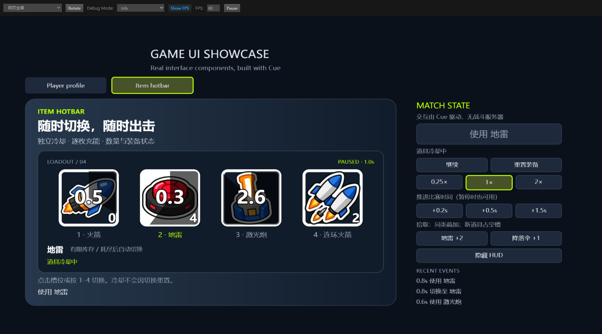

# Cue examples

This workspace contains real Vortex projects used to exercise Cue through its public packages.

Both projects import `.cc.vue` sources directly through `@bsgames/oms-plugin-cue` in
`oms.config.js`. OMS owns development builds, dependency watching and production output.
The compiler's facade/script/template/style modules stay in memory; no pre-generated JavaScript
or CLI step is required. Development changes use OMS's existing whole reload, not fine-grained HMR.

## Showcase

[Game UI Showcase](game-ui-showcase/README.md) presents complete game UI components built with Cue.
Case tabs and state controls are also built with Cue. The images below are captured from the running project.

| Preview | Description |
| --- | --- |
|  | **[Player profile](game-ui-showcase/src/cases/player-profile/player-profile.cc.vue)** — A reactive lobby HUD with an avatar, nickname, level badge, and live experience bar. Change the nickname, font size, or width to see Flex reflow and text wrapping; level and experience update in place. |
|  | **[Item hotbar](game-ui-showcase/src/cases/item-hotbar/item-hotbar.cc.vue)** — Four reactive item slots with selection, radial cooldowns, serial charges and stack counts. Use, exhaust and pick up items; pause to inspect transitions. |

## Local setup

1. Keep this repository next to `cc-extension-cue`.
2. Build the Cue repository with `node --run build`.
3. Run `pnpm install` in this repository.
4. Install each project's Cue and oh-my-script extensions with exm. Use the OMS plugin-enabled worktree for the extension and the linked `@oms/plugin` package; current local links target `U:/Repos/codex-worktrees/d3b7/cc-extension-oh-my-script`.
5. Run `node --run build` for actual OMS development and production script builds, then open `basic` or `game-ui-showcase` in Vortex.
6. Open `assets/main.scene` and start Preview.

`node --run test` builds the existing renderer smoke tests through OMS's headless profile and
runs the resulting ESM bundle. Both build and test assert that `src/generated` does not exist,
that source imports do not reference `.cc.vue.js`, and that no CLI compilation step is configured.
Only OMS's final `temp/oms` and `build/oms-validation` outputs are written.
`node scripts/verify-oms-watch.ts` checks real OMS source/metadata update, deletion and recovery
with a disposable fixture. These are script-pipeline checks, not a complete Cocos application export.

The projects serve different purposes:

- [basic](basic/README.md) has isolated Flex, Text, Image, Decoration, Position, Style API, Input,
  Button, Toggle, Slider, Select, TextInput, and NumberInput galleries.
- [game-ui-showcase](game-ui-showcase/README.md) has complete game UI components selected through a tab registry.

Every project is self-hosted: one CueDocument renders the gallery stage and the control plane
together. The six built-in control galleries each compare default and custom Cue controls, with
independent values and event logs. Navigation tabs, panel choices, menus, the experience slider and
the remount/apply actions are all Cue elements now; Cocos keeps only the scene, the cameras, the
font assets and the single native EditBox used as the focus/IME comparison fixture.
Input Gallery demonstrates Cue clicks, hover, propagation, pointer capture, clipping, transformed hits,
and `pointer-events` pass-through. The player HUD's avatar toggles profile details, and its draggable
experience meter shares state with the Cue slider in the same document.

Saved browser regressions exercise the running projects through actual mouse/touch input:
[`scripts/verify-input-preview.ts`](scripts/verify-input-preview.ts) checks the basic gallery, and
[`scripts/verify-hud-input-preview.ts`](scripts/verify-hud-input-preview.ts) checks the HUD, and
[`scripts/verify-hotbar-preview.ts`](scripts/verify-hotbar-preview.ts) checks the item hotbar through mouse,
keyboard and rendered cooldown pixels. [`scripts/verify-hotbar-regressions.ts`](scripts/verify-hotbar-regressions.ts)
checks shortcuts after blank clicks, foreign text editor isolation and icon/frame separation.
Each requires a Preview URL and an explicit existing Playwright installation path. Commands and
screenshot output are documented in the respective project READMEs. The development dependency
on `playwright-core` supplies types; the scripts still load the explicit installation and do not
download browsers during setup.

## Code checks

Keep the Cue repository alongside this workspace as `cc-extension-cue` and install both
workspaces' dependencies before linting. The standalone TypeScript command also requires the
Cue packages to be built:

```text
node --run lint
node --run test:lint
pnpm exec tsc -p tsconfig.eslint.json
```

The lint configuration covers TypeScript, JavaScript and `.cc.vue` scripts and templates. It uses a
standalone TypeScript configuration so these checks do not require Creator's generated `temp`
files. Cue package types resolve directly from the sibling repository's sources, so lint does not
require a prior build. Generated project outputs and installed editor extensions are excluded.

The standard Vue configuration from `@shrinktofit/eslint-config/vue` parses `.cc.vue` directly,
including type-aware script checks, without a custom processor or filename adapter. Template text
whitespace is preserved because Cue renders it literally; content-newline rules therefore do not
apply to `.cc.vue` templates. The Vue line-length rule exempts lines containing literal template
text while retaining the 100-column limit for scripts and attributes. Single-line attributes sit
beside the tag name; multiline attributes start below it. `test:lint` verifies script rules, typed
promise checks and autofix source offsets.

## Pull request checks

The PR workflow installs dependencies and runs `node --run lint`. It checks out `shrinktofit/cue`
alongside this repository and installs both workspaces so type-aware lint can resolve Cue's
source types and dependencies. No build or editor environment is required.
